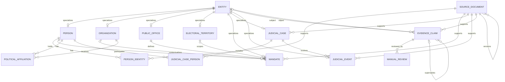
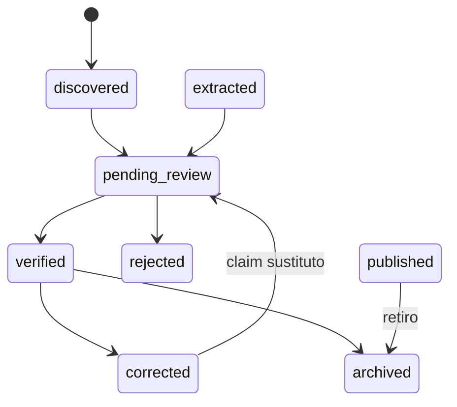

# Modelo de datos del núcleo histórico

Esta es la implementación mínima del modelo conceptual. Usa PostgreSQL,
SQLAlchemy 2 tipado, UUID internos y Alembic. No implementa las 26 entidades del
dominio completo: prioriza identidad, trayectoria política, justicia,
procedencia, claims y revisión.

## Separación central

- `Entity` da identidad interna común a cualquier sujeto u objeto de una
  afirmación. Su catálogo impide tipos arbitrarios.
- `SourceDocument` describe el documento y su procedencia. No es por sí mismo
  una conclusión.
- `EvidenceClaim` expresa una afirmación atómica sujeto–predicado–objeto y la
  vincula a un documento y fragmento. Su revisión y publicación son explícitas.

Las tablas especializadas usan `entity_id` como PK/FK a `entities`. Así, un
claim puede referenciar sujetos y objetos heterogéneos conservando integridad
referencial.

## Diagrama

## Tablas

`entities`, `persons`, `person_identities`, `public_offices`,
`electoral_territories`, `organizations`, `mandates`,
`political_affiliations`, `judicial_cases`, `judicial_case_persons`,
`judicial_events`, `source_documents`, `source_snapshots`, `ingestion_runs`,
`evidence_claims` y `manual_reviews`.

## Restricciones críticas

- UUID como identificador principal; identificadores externos viven en
  `PersonIdentity`.
- catálogos SQL cerrados para tipos, estados, niveles y predicados;
- `source_key + source_person_id` identifica una identidad de fuente, nunca el
  nombre mostrado;
- cada claim tiene exactamente un objeto: entidad o literal JSON, no ambos;
- confianza técnica nullable entre 0 y 1;
- predicados ilícitamente concluyentes no existen en el catálogo;
- `ManualReview` exige al menos un target y revisor no vacío;
- hash de 64 caracteres y unicidad compuesta por fuente, hash y recuperación;
  el SHA-256 no es globalmente único;
- fechas de término no pueden preceder al inicio cuando ambas existen;
- causa única por tribunal e identificador;
- no hay `ON DELETE CASCADE`: evidencia, documentos, claims y revisiones no
  desaparecen por eliminar una entidad relacionada;
- correcciones crean un claim nuevo con `supersedes_claim_id`; el anterior queda
  `corrected/withdrawn`.

Además de constraints de base de datos, el servicio exige para verificar
`CONVICTED_IN`: documento judicial decisorio, participación coincidente con
`outcome=convicted` y revisión humana.

## Ejemplo ficticio

El fixture conserva dos claims distintos para Persona Ficticia A:
`ACCUSED_IN` respaldado por una presentación y `ACQUITTED_IN` respaldado por una
decisión final. Ninguno se borra y no existe `CONVICTED_IN` para esa persona.

Persona Ficticia B tiene una participación con resultado `convicted`, una
decisión final ficticia y una revisión manual; solo entonces su claim puede
alcanzar `verified`. Una fuente `media_reference` es rechazada por la validación
de esa transición.

`PARTNER_OF` representa una relación societaria documentada. No existe ninguna
derivación hacia corrupción, delito o sospecha.

## Transiciones

La publicación tiene un eje separado:
`private → review_only → publishable → published → withdrawn`. Solo la aprobación
humana de un claim pendiente produce `publishable`; solo un claim verificado y
publicable puede pasar a `published`.

## Limitaciones

- no hay usuarios ni autenticación; `reviewer_identifier` es local;
- no hay API pública ni frontend;
- no hay score, grafos, IA ni ingestión masiva;
- los roles normalizados tienen catálogo inicial; el rol original permanece
  libre para sistemas históricos;
- las reglas sensibles también viven en servicios de dominio y deben mantenerse
  si aparecen otros canales de escritura;
- aún no se modelan actividad parlamentaria, contratos, patrimonio, lobby ni
  sanciones administrativas en PostgreSQL;
- SQLite se usa únicamente en tests rápidos; producción y migraciones están
  diseñadas para PostgreSQL.
