# Modelo conceptual histórico

Este documento define el lenguaje del dominio antes del diseño físico. No
prescribe tablas ni autoriza nuevas integraciones. El modelo separa personas,
hechos históricos, evidencia documental, claims revisables y procesos de
ingestión.

## Entidades

### Identidad, cargos y territorio

- **Person**: persona natural estable dentro del sistema. No contiene juicios ni
  presupone que dos nombres representan a la misma persona.
- **PersonIdentity**: nombre original, nombre normalizado, identificador oficial,
  tipo de identificador, fuente, período de vigencia y estado de revisión.
  Permite múltiples identidades documentadas sin fusionarlas automáticamente.
- **PublicOffice**: definición de un cargo público, organismo, nivel y tipo.
- **Mandate**: desempeño de una `Person` en un `PublicOffice`, con inicio,
  término, modo de acceso, territorio, fuente y claim.
- **PoliticalAffiliation**: militancia o afiliación histórica entre persona y
  partido, con fechas, valor original, fuente y evidencia.
- **ElectoralTerritory**: territorio versionado por sistema electoral: tipo,
  número, nombre, inicio, término y fuente. No traduce distritos históricos al
  mapa actual.

### Organizaciones y actividad económica

- **Organization**: entidad colectiva pública, privada, política o social.
- **Company**: especialización conceptual de organización con identificadores
  registrales y forma jurídica. No se identifica solo por razón social.
- **OrganizationMembership**: rol histórico de una persona u organización
  dentro de otra organización, incluyendo socio, accionista, director o miembro.
- **PublicContract**: contrato, orden o adjudicación pública entre organismo y
  proveedor, con identificadores, fechas, montos originales, estado y fuente.

### Actividad parlamentaria

- **ParliamentarySession**: sesión oficial, legislatura, fechas, estado y fuente.
- **Attendance**: estado original de asistencia de una persona en una sesión.
- **VoteEvent**: votación oficial. Su vínculo a sesión es nullable si la fuente
  no entrega una relación explícita.
- **IndividualVote**: opción original de una persona en un `VoteEvent`.

### Justicia y administración

- **JudicialCase**: causa identificada por tribunal, competencia, rol/RIT/RUC u
  otro identificador histórico, fechas y estado. Soporta sistemas anteriores y
  posteriores a la Reforma Procesal Penal.
- **JudicialCasePerson**: participación documentada de una persona en una causa.
  Registra `person_id`, `case_id`, rol procesal original, rol normalizado
  extensible, fecha de inicio, fecha de término, resultado final, firmeza,
  fuente y revisión humana. El catálogo de roles no se limita a imputado,
  acusado o condenado ni al procedimiento penal vigente.
- **JudicialEvent**: presentación, audiencia, resolución, sentencia, recurso,
  sobreseimiento, absolución, condena u otro evento, conservando tipo y texto
  original, fecha, resultado y documento.
- **AdministrativeCase**: expediente seguido por una autoridad administrativa,
  con partes, competencia, eventos y estado.
- **AdministrativeSanction**: sanción expresamente impuesta por resolución,
  incluyendo vigencia, recursos, revocación, cumplimiento y documento.

### Transparencia y relaciones

- **LobbyMeeting**: audiencia o reunión registrada conforme a su fuente,
  participantes, representados, materia, fecha y organismo.
- **AssetDeclaration**: declaración de intereses o patrimonio, período,
  declarante, versión, documento y rectificaciones. Declarar un activo no prueba
  irregularidad.
- **RelationshipEvidence**: relación histórica explícita entre dos entidades.
  Conserva tipo controlado, inicio, término, fuente, claim, nivel de evidencia y
  estado de revisión. No reemplaza el claim ni su documento.

### Procedencia, afirmaciones y control

- **SourceDocument**: documento lógico publicado por una fuente: título, emisor,
  tipo, fecha, URL, identificadores y restricciones.
- **SourceSnapshot**: captura inmutable de una versión del documento o respuesta,
  con fecha, contenido original, hash, protocolo y metadatos técnicos.
- **EvidenceClaim**: afirmación atómica respaldada y revisable.
- **IngestionRun**: ejecución manual o automatizada, configuración, versión,
  fechas, resultados, errores y snapshots producidos.
- **ManualReview**: decisión humana sobre identidad, claim, documento o
  publicación; registra revisor, fecha, resolución, motivo y referencias.

## EvidenceClaim

Un claim representa, por ejemplo, “la persona fue absuelta en la causa X” o “la
empresa Y recibió el contrato Z”. Contiene conceptualmente:

- sujeto tipado;
- predicado controlado;
- objeto tipado o valor literal;
- inicio y término de validez;
- nivel de evidencia;
- documento fuente y snapshot;
- fragmento exacto o localizador de respaldo;
- estado de revisión;
- fecha de extracción;
- fecha de rectificación;
- confianza técnica;
- estado publicado.

La confianza técnica expresa calidad de OCR, parsing o resolución de entidad. No
convierte una presentación judicial en sentencia, una decisión recurrible en
firme ni una mención en culpabilidad.

## Relaciones iniciales

Toda relación lleva inicio, término, fuente, claim asociado, nivel de evidencia
y estado de revisión.

| Relación | Uso permitido |
|---|---|
| `HELD_OFFICE` | persona desempeñó un cargo durante un mandato |
| `MEMBER_OF_PARTY` | afiliación política documentada |
| `MEMBER_OF_ORGANIZATION` | membresía documentada |
| `SHAREHOLDER_OF` | tenencia accionaria documentada |
| `DIRECTOR_OF` | ejercicio documentado como director |
| `PARTNER_OF` | calidad societaria documentada |
| `RECEIVED_PUBLIC_CONTRACT` | proveedor recibió contrato/adjudicación oficial |
| `PARTICIPATED_IN_CASE` | participación procesal con rol original |
| `ACCUSED_IN` | acusación formal presentada; no implica condena |
| `CONVICTED_IN` | condena establecida por decisión, indicando firmeza |
| `ACQUITTED_IN` | absolución establecida por decisión |
| `DISMISSED_FROM_CASE` | término/sobreseimiento documentado según figura original |
| `SANCTIONED_BY` | sanción impuesta por autoridad competente |
| `ATTENDED_LOBBY_MEETING` | participación registrada en audiencia de lobby |
| `VOTED_IN` | voto individual oficial |
| `ATTENDED_SESSION` | estado original de asistencia |
| `CO_DEFENDANT_WITH` | dos personas comparten formalmente posición procesal |
| `SERVED_WITH` | mandatos se superponen en un organismo |
| `CO_OWNED_WITH` | copropiedad documentada durante un período |

`CO_DEFENDANT_WITH`, `SERVED_WITH` y `CO_OWNED_WITH` solo describen coincidencia
formal y temporal; no implican coordinación, cercanía ni ilicitud.

Quedan prohibidas `CONSPIRED_WITH`, `CORRUPT_NETWORK` y
`CRIMINAL_ASSOCIATE`, salvo que una resolución oficial firme establezca
jurídicamente esa relación y el claim reproduzca estrictamente su alcance.
Aun en ese caso no se transforma en una etiqueta general sobre la persona.

## Evidencia, relación y conclusión

Estas capas no son intercambiables:

1. **Evidencia**: el documento y snapshot inmutables.
2. **Claim**: la afirmación atómica que un fragmento respalda.
3. **Relación**: representación histórica navegable derivada de un claim
   verificado.
4. **Conclusión**: presentación contextual limitada al alcance de los claims; no
   añade culpabilidad, intención o causalidad.

Un contrato oficial puede respaldar `RECEIVED_PUBLIC_CONTRACT`; no demuestra
favoritismo. Una acusación puede respaldar `ACCUSED_IN`; no respalda
`CONVICTED_IN`. Compartir una sociedad no demuestra parentesco ni acuerdo
ilícito.

## Diagrama conceptual

```mermaid
erDiagram
    Person ||--o{ PersonIdentity : has
    Person ||--o{ Mandate : holds
    PublicOffice ||--o{ Mandate : defines
    ElectoralTerritory o|--o{ Mandate : scopes
    Person ||--o{ PoliticalAffiliation : has
    Organization ||--o{ PoliticalAffiliation : party
    Person ||--o{ OrganizationMembership : participates
    Organization ||--o{ OrganizationMembership : contains
    Organization ||--o| Company : specializes
    Organization ||--o{ PublicContract : awards
    Company o|--o{ PublicContract : receives
    ParliamentarySession ||--o{ Attendance : records
    Person ||--o{ Attendance : attends
    VoteEvent ||--o{ IndividualVote : records
    Person ||--o{ IndividualVote : casts
    JudicialCase ||--o{ JudicialCasePerson : includes
    Person ||--o{ JudicialCasePerson : participates
    JudicialCase ||--o{ JudicialEvent : evolves
    AdministrativeCase ||--o{ AdministrativeSanction : resolves
    Person ||--o{ LobbyMeeting : attends
    Person ||--o{ AssetDeclaration : declares
    EvidenceClaim ||--o{ RelationshipEvidence : supports
    SourceDocument ||--o{ SourceSnapshot : captured_as
    SourceDocument ||--o{ EvidenceClaim : supports
    IngestionRun ||--o{ SourceSnapshot : produces
    ManualReview }o--|| EvidenceClaim : reviews
```

## Ejemplos de trayectoria

Una trayectoria puede mostrar: identidad oficial vigente entre fechas; mandato
en un territorio histórico; afiliación partidaria; asistencias y votos; ingreso
a una sociedad según registro; contrato de esa sociedad con un organismo; rol
en una causa; presentación inicial; decisión posterior y su firmeza. Cada tramo
mantiene su fuente y no se resume en una etiqueta sobre la persona.

Hechos permitidos incluyen “el registro indica que fue director entre A y B”,
“la querella fue presentada en la fecha C”, “el tribunal absolvió mediante la
decisión D” y “la resolución administrativa fue dejada sin efecto por E”.

Inferencias prohibidas incluyen fusionar homónimos, convertir coaparición en una
red ilícita, asumir parentesco por apellidos, tratar denuncia como condena,
convertir falta de registros en buena conducta o extender un territorio actual
a mandatos históricos.
